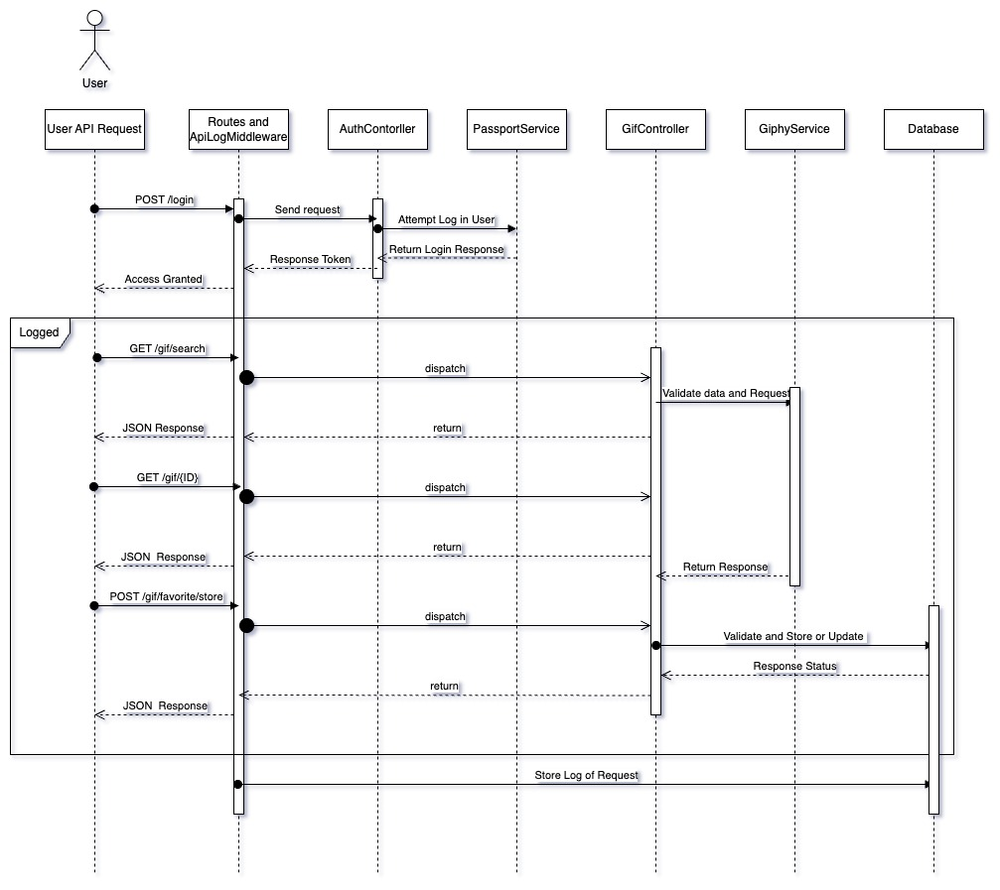

# Prex Giphy 

## Installation

1. Clone the project from here
```shell
git clone git@github.com:sergiogmuro/prex-giphy.git
```

2. Move into the project folder
```shell
cd prex-giphy
```

3. Create .env and .env.testing
```shell
cp .env.example .env

cp .env.testing.example .env.testing
```

> If you are using Mac, you could have some issues with the
> mysql container creation, so, I recommend to set the env var
> `DB_DOCKER_PATH`. 
> 
> E.g.: `/Users/your_user/docker-data/prex-giphy/mysql` 

4. Run next command to start and install all into the project
   > This command up the containers and install vendors,
   > migrations and create keys with the next command
```shell
./prex.sh install
```

-----

Other useful script commands of `./prex.sh `
```shell
up     Start the containers and always run the composer to try install new vendors
down   Stop all containers
bash   Go into the app container bash
```

------

## Testing

> Please, be sure that the testing database was created

Access into the app container
```shell
./prex.sh bash
```

Run tests
```shell
php artisan test
```

------

## Documentation

## Postman Collection
[PREX-GIPHY.postman_collection.json](documents/PREX-GIPHY.postman_collection.json)

###  Use Cases


###  Secuencial Diagram


###  DER (Not include auth)

